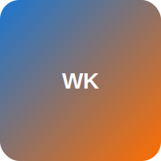

# workflow-kit

<p align="center">
  
</p>

<p align="center"><strong>Modern workflow automation for development teams</strong></p>

---

## Welcome

**workflow-kit** is a collection of production-ready GitHub Actions workflows that help automate common development tasks. Each workflow is designed to be:

- ✅ **Easy to adopt** — Setup in minutes with minimal configuration
- 🔧 **Highly customizable** — Fine-tune behavior to match your team's needs
- 📊 **Well-documented** — Comprehensive guides and examples
- 🚀 **Battle-tested** — Used in production by teams worldwide

## Available Workflows

### 🏷️ PR Auto-Labeler

Automatically label pull requests based on code changes, patterns, and metadata.

[Get Started →](workflows/pr-auto-labeler/index.md){ .md-button .md-button--primary }
[View Rules →](workflows/pr-auto-labeler/rules/index.md){ .md-button }

**Key Features:**

- 30+ intelligent labeling rules
- Zero-config sensible defaults
- Custom label mappings
- Debug mode for troubleshooting

!!! example "Quick Preview"
    ```yaml
    # Enable rules you want
    enabled_rules: '["ui-change", "test-missing", "large-pr"]'
    ```

---

## Why workflow-kit?

=== "Save Time"

    Stop manually labeling PRs, checking for tests, or reviewing security changes. Automate repetitive tasks and focus on what matters.

=== "Improve Quality"

    Catch issues early with automated checks. Flag missing tests, risky code, and large PRs before they reach review.

=== "Team Consistency"

    Standardize workflows across repositories. Everyone follows the same process with automated enforcement.

=== "Full Transparency"

    Open source and fully transparent. See exactly how each workflow works and customize as needed.

---

## Getting Started

Choose a workflow to explore:

<div class="grid cards" markdown>

-   :material-tag-multiple:{ .lg .middle } __PR Auto-Labeler__

    ---

    Automatically label PRs based on changes

    [:octicons-arrow-right-24: Quick Start](workflows/pr-auto-labeler/quick-start.md)

-   :material-playlist-plus:{ .lg .middle } __More Workflows Coming Soon__

    ---

    Stay tuned for additional workflows

    [:octicons-star-24: Watch on GitHub](#)

</div>

---

## Community

- [:fontawesome-brands-github: GitHub Repository](https://github.com/workflow-kit)
- [:material-chat: Discussions](https://github.com/workflow-kit/pr-auto-labeler/discussions)
- [:material-bug: Report Issues](https://github.com/workflow-kit/pr-auto-labeler/issues)

---

!!! tip "Contributing"
    workflow-kit is open source! Contributions, feedback, and suggestions are welcome. Check out our [contribution guidelines](#) to get started.
